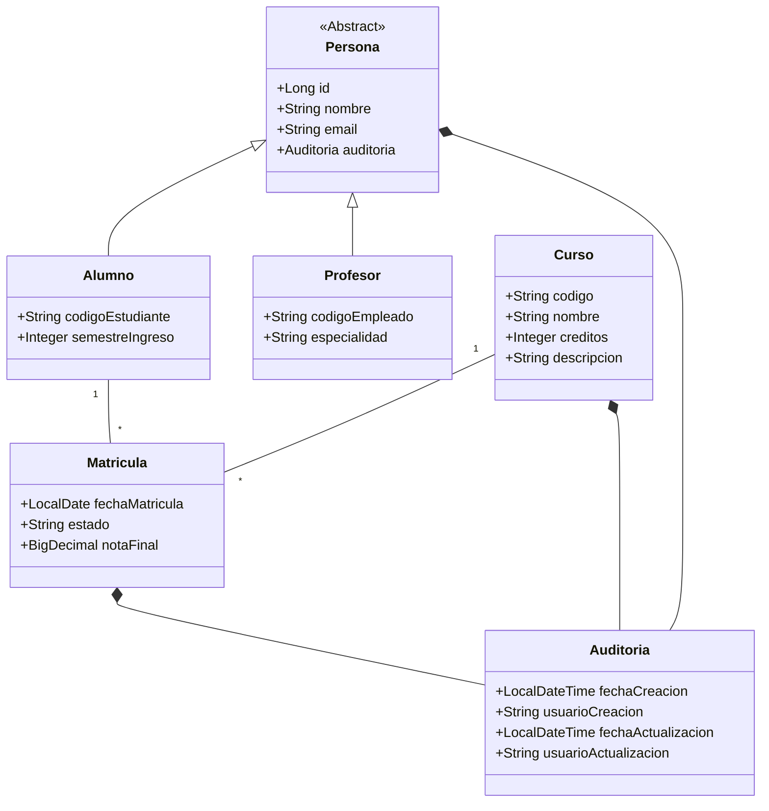
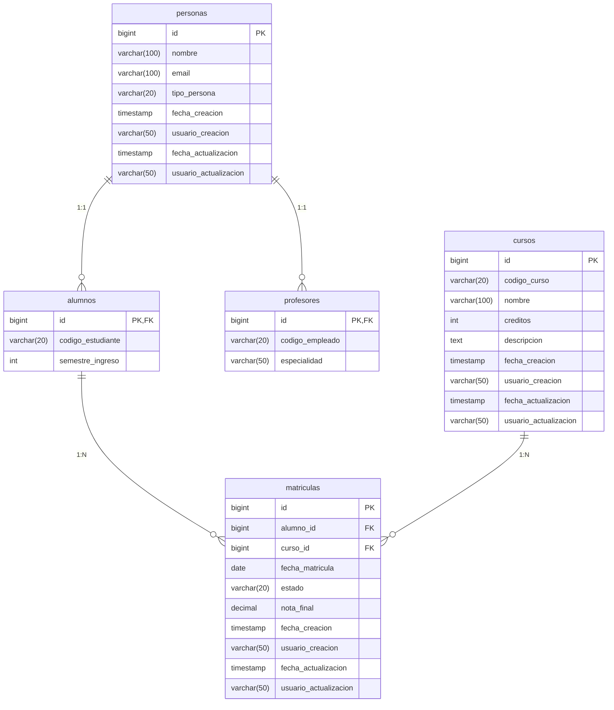
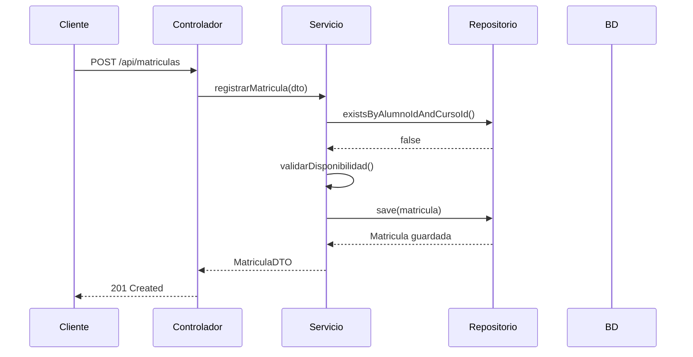

# 🎓 Sistema de Gestión Académica

<div align="center">
  
  
  
  
</div>

## 📋 Tabla de Contenidos
- [Modelo de Dominio](#-modelo-de-dominio)
- [Diagrama de Base de Datos](#-diagrama-de-base-de-datos)
- [Estructura de Entidades](#-estructura-de-entidades)
- [Consultas JPA](#-consultas-jpa)
- [Endpoints](#-endpoints)
- [Configuración](#-configuración)
- [Estructura del Proyecto](#-estructura-del-proyecto)

## 📊 Modelo de Dominio



### 📋 Caso de Negocio: Sistema de Gestión Académica Universitaria

Este sistema permite gestionar la información académica de una universidad, incluyendo estudiantes, profesores, cursos y matrículas. Se ha implementado siguiendo los principios de **Clean Architecture** y **Domain-Driven Design (DDD)**, con una clara separación de responsabilidades.

#### Características Principales:
- **Herencia JPA** con estrategia `JOINED` para el modelo de personas
- **Auditoría automática** en todas las entidades
- **Validaciones** a nivel de dominio
- **Patrón Repository** para el acceso a datos
- **DTOs** para la transferencia de datos
- **Paginación y ordenamiento** en consultas

## 🗃️ Diagrama de Base de Datos



## 🏗️ Estructura de Entidades

### 📝 Entidad Base: Persona

```java
@Entity
@Inheritance(strategy = InheritanceType.JOINED)
@DiscriminatorColumn(name = "tipo_persona")
public abstract class PersonaEntity {
    @Id
    @GeneratedValue(strategy = GenerationType.IDENTITY)
    private Long id;
    
    @Column(nullable = false, length = 100)
    private String nombre;
    
    @Column(nullable = false, unique = true, length = 100)
    private String email;
    
    @Embedded
    private Auditoria auditoria = new Auditoria();
    
    // Getters y Setters
}
```

### 👨‍🎓 Entidad: Alumno

```java
@Entity
@DiscriminatorValue("ALUMNO")
@Table(name = "alumnos")
public class AlumnoEntity extends PersonaEntity {
    
    @Column(name = "codigo_estudiante", nullable = false, unique = true, length = 20)
    private String codigoEstudiante;
    
    @Column(name = "semestre_ingreso", nullable = false)
    private Integer semestreIngreso;
    
    @OneToMany(mappedBy = "alumno", cascade = CascadeType.ALL, orphanRemoval = true)
    private Set<MatriculaEntity> matriculas = new HashSet<>();
    
    // Getters y Setters
}
```

### 📚 Entidad: Curso

```java
@Entity
@Table(name = "cursos")
public class CursoEntity {
    
    @Id
    @GeneratedValue(strategy = GenerationType.IDENTITY)
    private Long id;
    
    @Column(name = "codigo_curso", nullable = false, unique = true, length = 20)
    private String codigo;
    
    @Column(nullable = false, length = 100)
    private String nombre;
    
    @Column(nullable = false)
    private Integer creditos;
    
    @Lob
    private String descripcion;
    
    @OneToMany(mappedBy = "curso", cascade = CascadeType.ALL, orphanRemoval = true)
    private Set<MatriculaEntity> matriculas = new HashSet<>();
    
    @Embedded
    private Auditoria auditoria = new Auditoria();
    
    // Getters y Setters
}
```

### 📋 Entidad: Matrícula

```java
@Entity
@Table(name = "matriculas")
public class MatriculaEntity {
    
    @Id
    @GeneratedValue(strategy = GenerationType.IDENTITY)
    private Long id;
    
    @ManyToOne(fetch = FetchType.LAZY)
    @JoinColumn(name = "alumno_id", nullable = false)
    private AlumnoEntity alumno;
    
    @ManyToOne(fetch = FetchType.LAZY)
    @JoinColumn(name = "curso_id", nullable = false)
    private CursoEntity curso;
    
    @Column(name = "fecha_matricula", nullable = false)
    private LocalDate fechaMatricula;
    
    @Column(length = 20)
    private String estado;
    
    @Column(name = "nota_final", precision = 4, scale = 2)
    private BigDecimal notaFinal;
    
    @Embedded
    private Auditoria auditoria = new Auditoria();
    
    // Getters y Setters
}
```

### 🛡️ Clase: Auditoría

```java
@Embeddable
public class Auditoria implements Serializable {
    
    @Column(name = "fecha_creacion", updatable = false)
    private LocalDateTime fechaCreacion;
    
    @Column(name = "usuario_creacion", updatable = false, length = 50)
    private String usuarioCreacion;
    
    @Column(name = "fecha_actualizacion", insertable = false)
    private LocalDateTime fechaActualizacion;
    
    @Column(name = "usuario_actualizacion", insertable = false, length = 50)
    private String usuarioActualizacion;
    
    @PrePersist
    public void prePersist() {
        this.fechaCreacion = LocalDateTime.now();
        // Aquí se podría obtener el usuario actual del contexto de seguridad
        this.usuarioCreacion = "SISTEMA";
    }
    
    @PreUpdate
    public void preUpdate() {
        this.fechaActualizacion = LocalDateTime.now();
        this.usuarioActualizacion = "SISTEMA";
    }
    
    // Getters y Setters
}
```

## 🔍 Consultas JPA

### 🔍 Búsqueda de Cursos por Nombre

```java
@Repository
public interface CursoRepositoryJpa extends JpaRepository<CursoEntity, Long> {
    
    /**
     * Busca cursos cuyo nombre contenga el texto especificado (insensible a mayúsculas/minúsculas)
     * @param nombreParcial Texto a buscar en el nombre del curso
     * @return Lista de cursos que coinciden con el criterio de búsqueda
     */
    @Query("""
        SELECT c FROM CursoEntity c 
        WHERE LOWER(c.nombre) LIKE LOWER(CONCAT('%', :nombreParcial, '%'))
        """)
    List<CursoEntity> findByNombreContainingJpql(@Param("nombreParcial") String nombreParcial);
    
    /**
     * Busca cursos con paginación y ordenamiento
     * @param nombre Texto a buscar en el nombre del curso
     * @param pageable Configuración de paginación y ordenamiento
     * @return Página de cursos que coinciden con el criterio de búsqueda
     */
    @Query("""
        SELECT c FROM CursoEntity c 
        WHERE LOWER(c.nombre) LIKE LOWER(CONCAT('%', :nombre, '%'))
        """)
    Page<CursoEntity> findByNombreContainingJpql(
        @Param("nombre") String nombre,
        Pageable pageable
    );
    
    /**
     * Busca un curso por su código
     * @param codigo Código único del curso
     * @return Curso si se encuentra, vacío en caso contrario
     */
    Optional<CursoEntity> findByCodigo(String codigo);
}
```

### 📋 Consulta de Matrículas por Alumno

```java
@Repository
public interface MatriculaRepositoryJpa extends JpaRepository<MatriculaEntity, Long> {
    
    /**
     * Busca las matrículas de un alumno por su email
     * @param emailAlumno Email del alumno a buscar
     * @return Lista de matrículas ordenadas por fecha descendente
     */
    @Query("""
        SELECT DISTINCT m FROM MatriculaEntity m 
        LEFT JOIN FETCH m.alumno a
        LEFT JOIN FETCH m.curso c
        WHERE LOWER(a.email) = LOWER(:emailAlumno)
        ORDER BY m.fechaMatricula DESC
        """)
    List<MatriculaEntity> findByAlumnoEmail(@Param("emailAlumno") String emailAlumno);
    
    /**
     * Verifica si un alumno ya está matriculado en un curso específico
     * @param alumnoId ID del alumno
     * @param cursoId ID del curso
     * @return true si ya existe la matrícula, false en caso contrario
     */
    boolean existsByAlumnoIdAndCursoId(Long alumnoId, Long cursoId);
}
```

### 🔄 Paginación y Ordenamiento

```java
@RestController
@RequestMapping("/api/cursos")
@Tag(name = "Cursos", description = "API para la gestión de cursos")
public class CursoController {
    
    private final CursoRepositoryJpa cursoRepository;
    
    public CursoController(CursoRepositoryJpa cursoRepository) {
        this.cursoRepository = cursoRepository;
    }
    
    /**
     * Obtiene una lista paginada de cursos con filtro opcional por nombre
     * 
     * @param nombre Filtro opcional para buscar por nombre (parcial)
     * @param page Número de página (0-based)
     * @param size Tamaño de la página
     * @param sortBy Campo por el que ordenar
     * @param sortDir Dirección de ordenamiento (asc/desc)
     * @return Página de cursos que coinciden con los criterios
     */
    @GetMapping
    @Operation(summary = "Lista paginada de cursos", 
              description = "Obtiene una lista paginada de cursos con filtro opcional por nombre")
    public ResponseEntity<Page<CursoEntity>> listarCursos(
            @Parameter(description = "Filtro por nombre (parcial)", example = "matemáticas") 
            @RequestParam(defaultValue = "") String nombre,
            
            @Parameter(description = "Número de página (0-based)", example = "0") 
            @RequestParam(defaultValue = "0") int page,
            
            @Parameter(description = "Tamaño de la página", example = "10") 
            @RequestParam(defaultValue = "10") int size,
            
            @Parameter(description = "Campo por el que ordenar", example = "nombre") 
            @RequestParam(defaultValue = "nombre") String sortBy,
            
            @Parameter(description = "Dirección de ordenamiento (asc/desc)", example = "asc") 
            @RequestParam(defaultValue = "asc") String sortDir) {
        
        // Validar parámetros de paginación
        if (page < 0) page = 0;
        if (size <= 0 || size > 100) size = 10;
        
        // Crear objeto de ordenamiento
        Sort sort = sortDir.equalsIgnoreCase("desc") ? 
            Sort.by(sortBy).descending() : 
            Sort.by(sortBy).ascending();
        
        // Crear objeto de paginación con ordenamiento
        Pageable pageable = PageRequest.of(page, size, sort);
        
        // Ejecutar consulta paginada
        Page<CursoEntity> cursos = cursoRepository.findByNombreContainingJpql(
            nombre.trim(), 
            pageable
        );
        
        return ResponseEntity.ok(cursos);
    }
    
    @GetMapping("/{id}")
    @Operation(summary = "Obtener curso por ID", 
              description = "Obtiene los detalles de un curso por su ID")
    public ResponseEntity<CursoEntity> obtenerCursoPorId(
            @Parameter(description = "ID del curso", required = true, example = "1")
            @PathVariable Long id) {
        return cursoRepository.findById(id)
            .map(ResponseEntity::ok)
            .orElse(ResponseEntity.notFound().build());
    }
    
    @GetMapping("/codigo/{codigo}")
    @Operation(summary = "Obtener curso por código", 
              description = "Obtiene los detalles de un curso por su código único")
    public ResponseEntity<CursoEntity> obtenerCursoPorCodigo(
            @Parameter(description = "Código único del curso", required = true, example = "MAT101")
            @PathVariable String codigo) {
        return cursoRepository.findByCodigo(codigo)
            .map(ResponseEntity::ok)
            .orElse(ResponseEntity.notFound().build());
    }
}
```

## 🌐 Endpoints

### Cursos

| Método | Endpoint | Descripción | Parámetros |
|--------|----------|-------------|------------|
| `GET`  | `/api/cursos` | Lista paginada de cursos | `page`, `size`, `sortBy`, `sortDir`, `nombre` |
| `GET`  | `/api/cursos/{id}` | Obtiene un curso por su ID | `id` (path) |
| `GET`  | `/api/cursos/codigo/{codigo}` | Obtiene un curso por su código | `codigo` (path) |
| `POST` | `/api/cursos` | Crea un nuevo curso | JSON en el body |
| `PUT`  | `/api/cursos/{id}` | Actualiza un curso existente | `id` (path), JSON en el body |
| `DELETE` | `/api/cursos/{id}` | Elimina un curso | `id` (path) |

### Matrículas

| Método | Endpoint | Descripción | Parámetros |
|--------|----------|-------------|------------|
| `GET`  | `/api/matriculas/email` | Lista matrículas por email de alumno | `email` (query) |
| `GET`  | `/api/matriculas/alumno/{alumnoId}` | Lista matrículas por ID de alumno | `alumnoId` (path) |
| `POST` | `/api/matriculas` | Crea una nueva matrícula | JSON en el body |
| `PUT`  | `/api/matriculas/{id}` | Actualiza una matrícula existente | `id` (path), JSON en el body |
| `DELETE` | `/api/matriculas/{id}` | Elimina una matrícula | `id` (path) |

### Ejemplo de Respuesta Paginada

```json
{
  "content": [
    {
      "id": 1,
      "codigo": "MAT101",
      "nombre": "Matemáticas Básicas",
      "creditos": 4,
      "descripcion": "Curso introductorio de matemáticas"
    }
  ],
  "pageable": {
    "sort": {
      "sorted": true,
      "unsorted": false,
      "empty": false
    },
    "pageNumber": 0,
    "pageSize": 10,
    "offset": 0,
    "paged": true,
    "unpaged": false
  },
  "totalElements": 1,
  "totalPages": 1,
  "last": true,
  "size": 10,
  "number": 0,
  "sort": {
    "sorted": true,
    "unsorted": false,
    "empty": false
  },
  "numberOfElements": 1,
  "first": true,
  "empty": false
}
```

## 🛠️ Tecnologías Utilizadas

### Backend
- **Java 17** - Lenguaje de programación principal
- **Spring Boot 3.1.0** - Framework para aplicaciones Java
- **Spring Data JPA** - Para el acceso a datos
- **Hibernate** - ORM para el mapeo objeto-relacional
- **MySQL 8.0** - Sistema de gestión de bases de datos relacional
- **HikariCP** - Pool de conexiones de alto rendimiento
- **Lombok** - Para reducir el código boilerplate
- **MapStruct** - Para el mapeo entre entidades y DTOs
- **Springdoc OpenAPI** - Documentación de la API (Swagger UI)

### Herramientas de Desarrollo
- **Maven** - Gestión de dependencias y construcción
- **Git** - Control de versiones
- **Docker** - Contenedorización (opcional)
- **Postman** - Pruebas de API
- **IntelliJ IDEA** - Entorno de desarrollo

## ⚙️ Configuración

### Configuración Básica (`application.properties`)

```properties
# ===============================
# SERVER CONFIGURATION
# ===============================
server.port=8080
server.servlet.context-path=/api

# ===============================
# DATABASE CONFIGURATION
# ===============================
# MySQL Configuration
spring.datasource.url=jdbc:mysql://localhost:3306/sistema_academico?useSSL=false&serverTimezone=UTC&allowPublicKeyRetrieval=true
spring.datasource.username=root
spring.datasource.password=tu_contraseña
spring.datasource.driver-class-name=com.mysql.cj.jdbc.Driver

# HikariCP Configuration
spring.datasource.hikari.connection-timeout=20000
spring.datasource.hikari.maximum-pool-size=10
spring.datasource.hikari.minimum-idle=5

# ===============================
# JPA / HIBERNATE
# ===============================
# Hibernate ddl auto (validate|update|create|create-drop)
spring.jpa.hibernate.ddl-auto=validate
spring.jpa.show-sql=true
spring.jpa.properties.hibernate.format_sql=true
spring.jpa.properties.hibernate.dialect=org.hibernate.dialect.MySQL8Dialect

# Naming strategy
spring.jpa.hibernate.naming.physical-strategy=org.hibernate.boot.model.naming.PhysicalNamingStrategyStandardImpl

# ===============================
# LOGGING
# ===============================
logging.level.org.hibernate.SQL=DEBUG
logging.level.org.hibernate.type.descriptor.sql.BasicBinder=TRACE
logging.level.org.springframework.web=INFO

# ===============================
# OPEN API (Swagger)
# ===============================
springdoc.api-docs.path=/api-docs
springdoc.swagger-ui.path=/swagger-ui.html
springdoc.swagger-ui.operationsSorter=method
```

### Configuración de CORS (opcional)

```java
@Configuration
@EnableWebMvc
public class WebConfig implements WebMvcConfigurer {
    
    @Override
    public void addCorsMappings(CorsRegistry registry) {
        registry.addMapping("/**")
            .allowedOrigins("http://localhost:3000") // Frontend URL
            .allowedMethods("GET", "POST", "PUT", "DELETE", "OPTIONS")
            .allowedHeaders("*")
            .allowCredentials(true);
    }
}
```

## 📁 Estructura del Proyecto

```
src/main/java/pe/cibertec/dawi_t1_hacho_haho_jhabel/
├── DawiT1HachoHahoJhabelApplication.java   # Punto de entrada de la aplicación
│
├── domain/                                 # Capa de Dominio
│   ├── model/                              # Modelos de dominio
│   │   ├── Persona.java                    # Entidad base Persona
│   │   ├── Alumno.java                     # Entidad Alumno
│   │   ├── Profesor.java                   # Entidad Profesor
│   │   ├── Curso.java                      # Entidad Curso
│   │   └── Matricula.java                  # Entidad Matrícula
│   │
│   ├── repository/                         # Interfaces de repositorio
│   │   ├── CursoRepository.java
│   │   └── MatriculaRepository.java
│   │
│   └── service/                            # Servicios de dominio
│       ├── CursoService.java
│       └── MatriculaService.java
│
├── application/                            # Capa de Aplicación
│   ├── dto/                                # DTOs para entrada/salida
│   │   ├── request/
│   │   └── response/
│   │
│   ├── mapper/                             # Mappers (MapStruct)
│   │   ├── CursoMapper.java
│   │   └── MatriculaMapper.java
│   │
│   └── usecase/                            # Casos de uso
│       ├── CursoUseCase.java
│       └── MatriculaUseCase.java
│
├── infrastructure/                         # Capa de Infraestructura
│   └── persistence/
│       ├── config/                         # Configuraciones
│       │   ├── JpaConfig.java
│       │   └── AuditorAwareImpl.java
│       │
│       ├── entity/                         # Entidades JPA
│       │   ├── PersonaEntity.java
│       │   ├── AlumnoEntity.java
│       │   ├── CursoEntity.java
│       │   └── MatriculaEntity.java
│       │
│       ├── jpa/                            # Repositorios JPA
│       │   ├── CursoRepositoryJpa.java
│       │   └── MatriculaRepositoryJpa.java
│       │
│       └── shared/                         # Clases compartidas
│           └── Auditoria.java              # Clase de auditoría
│
└── presentation/                           # Capa de Presentación
    ├── controller/                         # Controladores REST
    │   ├── CursoController.java
    │   ├── MatriculaController.java
    │   └── HomeController.java
    │
    ├── advice/                             # Manejo de excepciones
    │   └── GlobalExceptionHandler.java
    │
    └── config/                             # Configuración web
        ├── WebConfig.java                  # CORS, etc.
        └── SwaggerConfig.java              # Documentación API

src/main/resources/
├── application.properties                  # Configuración de la aplicación
├── application-dev.properties              # Configuración para desarrollo
├── application-prod.properties             # Configuración para producción
└── db/
    └── migration/                          # Migraciones de base de datos
        ├── V1__Initial_schema.sql
        └── V2__Sample_data.sql
```

## 🚀 Ejecución del Proyecto

### Requisitos Previos
- Java 17 o superior
- MySQL 8.0 o superior
- Maven 3.8+

### Pasos para la Ejecución

1. **Clonar el repositorio**
   ```bash
   git clone <url-del-repositorio>
   cd dawi_t1_hacho_haho_jhabel
   ```

2. **Configurar la base de datos**
   - Crear una base de datos MySQL llamada `sistema_academico`
   - Ejecutar el script SQL ubicado en `src/main/resources/db/migration/`

3. **Configurar las credenciales**
   - Editar el archivo `src/main/resources/application-dev.properties`
   - Configurar usuario y contraseña de MySQL

4. **Ejecutar la aplicación**
   ```bash
   # Modo desarrollo
   mvn spring-boot:run -Dspring-boot.run.profiles=dev
   
   # O para producción
   mvn spring-boot:run -Dspring-boot.run.profiles=prod
   ```

5. **Acceder a la documentación**
   - Swagger UI: http://localhost:8080/api/swagger-ui.html
   - API Docs: http://localhost:8080/api/api-docs

## 📚 Documentación Adicional

### Diagrama de Secuencia - Matrícula de Alumno



## 🏁 Conclusión

Este proyecto implementa un sistema de gestión académica siguiendo los principios de **Clean Architecture** y **Domain-Driven Design (DDD)**, con una clara separación de responsabilidades entre las diferentes capas de la aplicación. Se ha puesto especial énfasis en:

- **Mantenibilidad**: Código limpio, bien estructurado y documentado
- **Escalabilidad**: Arquitectura que permite el crecimiento del sistema
- **Rendimiento**: Uso de HikariCP para la gestión de conexiones y consultas optimizadas
- **Seguridad**: Validaciones a nivel de dominio y base de datos
- **Documentación**: API documentada con OpenAPI/Swagger

## ✒️ Autor

- **Nombre**: Hacho Haho Jhabe
- **Curso**: DAWI - Desarrollo de Aplicaciones Web I
- **Ciclo**: 2025-2
- **Contacto**: [tu.email@cibertec.edu.pe](mailto:tu.email@cibertec.edu.pe)

---

<div align="center">
  <p>🎓 Proyecto académico desarrollado para la asignatura de Desarrollo de Aplicaciones Web I</p>
  <p>🏛️ CIBERTEC - Formando a los profesionales que el Perú necesita</p>
</div>
